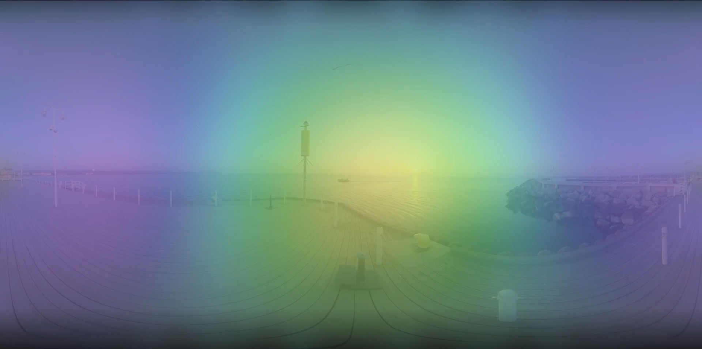

# AES 2025 - AmbiScopeVFX manuscript

> Presented at the 2025 AES Europe Convention Student Project Expo

## Abstract

This paper presents an open source solution for integrating ambisonic audio
visualization with 360$^\circ$ video, targeting immersive virtual reality
(VR) content production. The proposed tool, implemented as a Fuse plugin within
DaVinci Resolve’s Fusion module, overlays a real-time ambisonic sound field
heatmap onto video footage. It receives spatial intensity data via the Open
Sound Control (OSC) protocol, transmitted from the IEM EnergyVisualizer plugin.
The visualization facilitates synchronization and spatial coherence between
audio and visual layers during editing. 

## Code

Please refer to the Gdańsk University of Technology GitLab repository -
[AmbiScopeVFX](https://git.pg.edu.pl/p1350373/ambiscopevfx)
